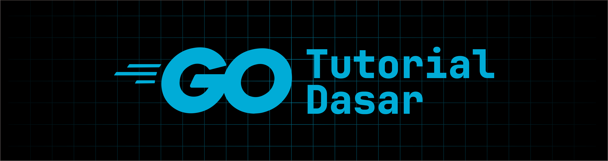

# Golang

Golang (sering di sebut Go), adalah bahasa pemrograman yang dikembangkan oleh Google dan bersifat open-source. Go mulai dikembangkan pada tahun 2007 kemudian di perkenalkan ke publik pada tahun 2009. Golang dirancang untuk efisiensi, skalabilitas, serta kemudahan penggunaan, terutama dalam pengembangan perangkat lunak yang membutuhkan performa tinggi.

## Kegunaan Golang

- Pengembangan aplikasi backend dan API.
- Pemrograman sistem dan jaringan.
- Microservices.
- Alat-alat baris perintah (CLI).
- Proyek cloud-native, seperti Docker dan Kubernetes, yang ditulis menggunakan Go.
